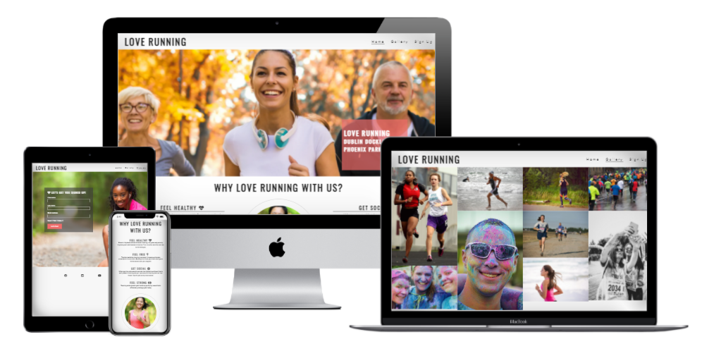
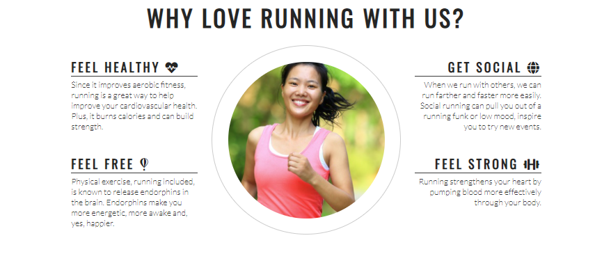
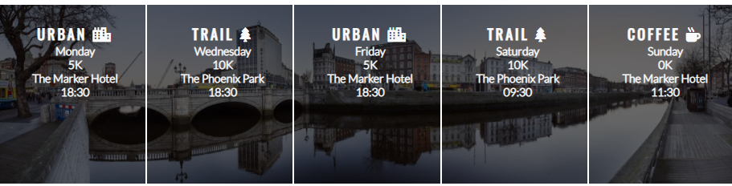
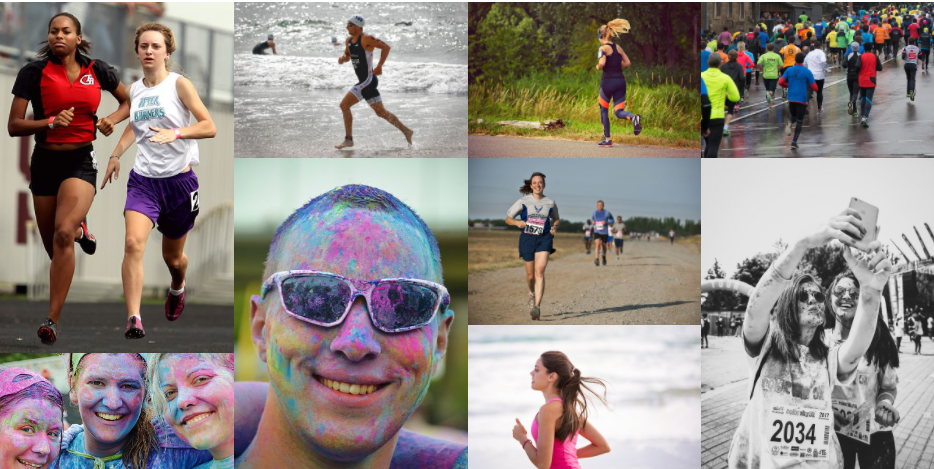
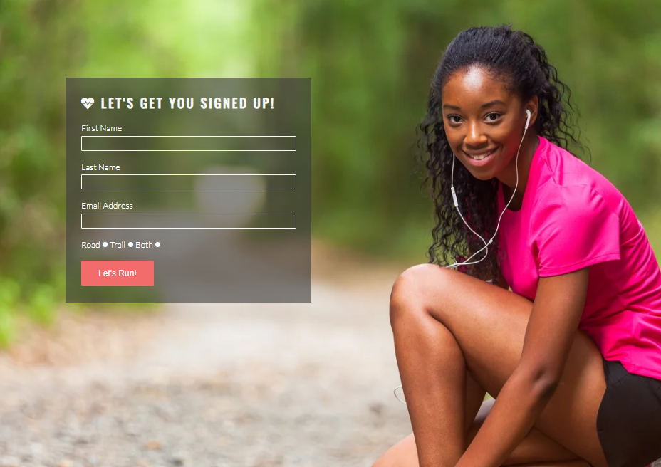

# Love Running

In this section, you will include one or two paragraphs providing an overview of your project. Essentially, this part is your sales pitch. At this stage, you should have a name for your project so use it! Don’t introduce the project as a Portfolio project for the diploma. In this section, describe what the project hopes to accomplish, who it is intended to target and how it will be useful to the target audience. 

For example; Love Running is a site that hopes to help keep people motivated to meet up for runs on a regular basis in Dublin, Ireland. The site will be targeted toward runners who are looking for a way to socialise and keep themselves fit. Love Running will be useful for runners to see exactly when and where they should be to join the running club. 

## Features 

In this section, you should go over the different parts of your project, and describe each in a sentence or so. You will need to explain what value each of the features provides for the user, focusing on who this website is for, what it is that they want to achieve and how your project is the best way to help them achieve these things.

### Existing Features

- __Navigation Bar__

  - Featured on all three pages, the full responsive navigation bar includes links to the Logo, Home page, Gallery and Sign Up page and is identical in each page to allow for easy navigation.
  - This section will allow the user to easily navigate from page to page across all devices without having to revert back to the previous page via the ‘back’ button. 

- __The landing page image__

  - The landing includes a photograph with text overlay to allow the user to see exactly which location this site would be applicable to. 
  - This section introduces the user to Love Running with an eye catching animation to grab their attention

- __Club Ethos Section__

  - The club ethos section will allow the user to see the benefits of joining the Love Running meetups, as well as the benefits of running overall. 
  - This user will see the value of signing up for the Love Running meetups. This should encourage the user to consider running as their form of exercise. 

- __Meetup Times section__

  - This section will allow the user to see exactly when the meetups will happen, where they will be located and how long the run will be in kilometers. 
  - This section will be updated as these times change to keep the user up to date. 

- __The Footer__ 

  - The footer section includes links to the relevant social media sites for Love Running. The links will open to a new tab to allow easy navigation for the user. 
  - The footer is valuable to the user as it encourages them to keep connected via social media

- __Gallery__

  - The gallery will provide the user with supporting images to see what the meet ups look like. 
  - This section is valuable to the user as they will be able to easily identify the types of events the organisation puts together. 

- __The Sign Up Page__

  - This page will allow the user to get signed up to Love Running to start their running journey with the community. The user will be able specify if they would like to take part in road, trail or both types of running. The user will be asked to submit their full name and email address. 

### Features Left to Implement

- Another feature idea

## Testing 

## Responsiveness

    This part of the testing was done in Lighthouse throughout the project to ensure the content of each page remained fully responsive and 100% visible after each amendment. The testing tool was set to the most common Samsung, Apple and Google products to cover the full range of screens from the smallest being the Galaxy fold Z 5 (344px) to a curved 27" external monitor.

  ### Functionality

  Features checked during testing included checking:

    Nav Bar

      - that up until screens width 768px (tablets and larger mobiles) the menu is hidden in the burger icon in the upper left corner and expands and collaps when clicked

      - that upon expanding the menu the solid line indicating the part of the page the user is currently on is visible under the correct active menu item

      - that from screen width 768px onwards the nav bar is spread out and adjusts automatically to take up the available space and the features of a solid line under the menu item and the menu items changing colours is inherited

      - that the hyperlink linked to each each menu item and the logo is working as expected and connect to the correct parts of the webpage

    Homepage

      - that the hero image adjusts proportional to the screen size and is not distorted on either screen
      - that content and image in the middle section adjust proprotional to the screen size, the conetent remains fully visible and readable at all times
      - that the image grid adjusts to the screen size with all images staying visible and are not distorted on either screen
      - that the social icons are clickable and embedded the hyperlinks open up to a new page

    Gallery

      - that all images adjust proportionally to the screen size and are spread out to fill the additional space on larger screens

    Sign form

    - that the fields mandatory to fill in are working as expected so the user cannot submit an incorrect or incomplete form
    - that the radio buttons work as expected
    - that the submit button submits the form when clicked

### Validator Testing 

- HTML
  - No errors were returned when passing through the official [W3C validator](https://validator.w3.org/nu/?doc=https%3A%2F%2Fcode-institute-org.github.io%2Flove-running-2.0%2Findex.html)
- CSS
  - No errors were found when passing through the official [(Jigsaw) validator](https://jigsaw.w3.org/css-validator/validator?uri=https%3A%2F%2Fvalidator.w3.org%2Fnu%2F%3Fdoc%3Dhttps%253A%252F%252Fcode-institute-org.github.io%252Flove-running-2.0%252Findex.html&profile=css3svg&usermedium=all&warning=1&vextwarning=&lang=en#css)

### Unfixed Bugs

no bugs known

## Deployment 

- The site was deployed to GitHub pages. The steps to deploy are as follows: 
  - In the GitHub repository, navigate to the Settings tab 
  - From the source section drop-down menu, select the Master Branch
  - Once the master branch has been selected, the page will be automatically refreshed with a detailed ribbon display to indicate the successful deployment. 

The live link can be found here - https://code-institute-org.github.io/love-running-2.0/index.html 

## Credits 

- The structure of the README was taken from the template provided by Code Institute
- The project was a Walkthrough project except for the signup page challenge for which the HTML and CSS had to be written and implemented by me, the student.

### Content 

- The text for the Homepage was taken from Wikipedia Article A
- Instructions on how to implement form validation on the Sign Up page was taken from [Specific YouTube Tutorial](https://www.youtube.com/)
- The icons in the footer were taken from [Font Awesome](https://fontawesome.com/)

### Media

- The photos used on the home and sign up page are from This Open Source site
- The images used for the gallery page were taken from this other open source site

